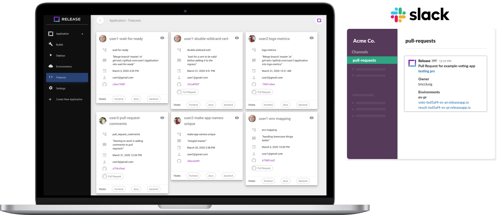

  

Ephemeral Environments for every Pull-Request. Any stack, any time.

    <!-- <a href="mailto:hello@releaseapp.io?subject=I%20would%20like%20a%20demo!&body=I%20would%20like%20a%20demo%20of%20Release."> -->
    

    <a href="https://releaseapp.io/">Release</a> |
    <a href="https://docs.releaseapp.io/">Docs</a> |
    <a href="https://releaseapp.io/pricing-page">Pricing</a> |
    <a href="https://releaseapp.io/blog/">Blog</a> |
    <a href="https://github.com/TryGhost/Ghost/blob/master/.github/CONTRIBUTING.md">Contributing</a> |
    <a href="https://twitter.com/release_app">Twitter</a>
      
    
    
     
    
    

Love Environments? <a href="https://releaseapp.io/company">We're hiring</a> to work on Release full-time.

&nbsp;

&nbsp;

# About Release

Release unlocks the ability to create fully autonomous environments from any git branch. Built on the back of Kubernetes, you can be confident with Release's ability to scale your application, no matter what your stack looks like, all without having to know Kubernetes. Through the power of <a href="https://docs.releaseapp.io/reference-guide/instant-datasets" alt="instance datasets documentation">instant datasets</a>, each environment is built using data you can rely on.  

The easiest way to get get started with Release is to <a href="mailto:hello@releaseapp.io?subject=Release:%20Getting%20started%20with%20white-glove%20onboarding&body=I%20would%20like%20to%20hear%20about%20Release's%20white-glove%20onboarding%20process." alt="email hello@releaseapp.io">inquire about our white-glove onboarding</a> or <a href="https://calendly.com/tommy-release/60min" alt="Schedule a time with Tommy@Release with Calendly">schedule a demo</a>. If you're a self-starter or looking to unlock environments for your personal projects, check out the <a href="https://github.com/awesome-release" alt="Awesome Release">example applications</a> and explore the <a href="https://docs.releaseapp.io/" alt="Release Docs">documentation</a>.

 
  

&nbsp;

# Getting Help

If you've ran into a problem, require help with Release, or have questions we recommend opening an [issue in Github](https://github.com/releaseapp-io/release/issues).

You can email us at hello@releaseapp.io or go to https://releaseapp.io and drop us a message in Intercom. Release **Small Team** and up customers will get a dedicated Slack channel so that you can interact with the team directly. 

To stay up to date with all the latest news and product updates, make sure you [subscribe to our blog](https://releaseapp.io/blog/) — or you can always follow us [on Twitter](https://twitter.com/release_app).

&nbsp;

# Sponsorship Opportunities

We ❤ love ❤ Open Source Software. 

If you have an open source project that could benefit from Environments on Every Pull Request, <a href="mailto:hello@releaseapp.io?subject=Release:%20I%20have%20an%20open%20source%20project&body=I%20have%20an%20open%20source%20project%20and%20would%20like%20to%20know%20how%20Release%20can%20help." alt="">message us</a> to see how we can fuel your rocketship! 🚀

&nbsp;

# Copyright & License

Copyright (c) 2020 Release Technologies
